# NovelCraft · AI Novel Writing Workspace

[简体中文](README.md) | **English**

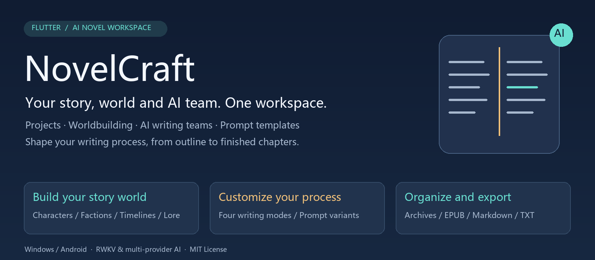

<p align="center">
  
  
  
  
  <a href="LICENSE"></a>
</p>

<p align="center">
  <a href="https://github.com/LuckySongXiao/Novelcraft_Flutter">Repository</a> ·
  <a href="https://github.com/LuckySongXiao/Novelcraft_Flutter/releases">Releases</a> ·
  <a href="docs/功能使用说明-v1.0.0+35.md">User Guide (Chinese)</a> ·
  <a href="https://github.com/LuckySongXiao/Novelcraft_Flutter/issues">Report an Issue</a>
</p>

**NovelCraft brings book projects, characters, worldbuilding, outlines, chapter prose and AI collaboration into one workspace.** Manage your creative material manually, or connect RWKV and other models to help with planning, drafting, polishing and review. Customize the prompt used at each supported workflow stage.

Originally built with C# WPF, the project is being developed in Flutter. Its primary deliverables are a portable Windows desktop package and an Android APK. It is designed for authors managing long-form fiction, creators exploring collaboration between models, and developers studying AI writing workflows.

> Current source version: **1.0.0+35**. This release focuses on multiple selectable prompt templates per writing stage. Content review and automatic revision remain experimental; see [Current Status and Known Limitations](#current-status-and-known-limitations). The diagrams illustrate features and workflows; see [Screenshots](#screenshots) for actual screenshots of the running application.

## Contents

- [Feature Overview](#feature-overview)
- [Screenshots](#screenshots)
- [From an Idea to a Novel](#from-an-idea-to-a-novel)
- [Four Prose Generation Modes](#four-prose-generation-modes)
- [Prompt Template Configuration](#prompt-template-configuration)
- [Model Integrations and Agent Roles](#model-integrations-and-agent-roles)
- [Reviewers and Guest Readers](#reviewers-and-guest-readers)
- [Quick Start](#quick-start)
- [Import, Export and Data Storage](#import-export-and-data-storage)
- [Development and Builds](#development-and-builds)
- [Architecture and Directory Layout](#architecture-and-directory-layout)
- [Testing and Verification](#testing-and-verification)
- [Current Status and Known Limitations](#current-status-and-known-limitations)
- [Documentation and Contributions](#documentation-and-contributions)

## Feature Overview

### 1. Organize your writing around book projects

Each book has its own project context. Volumes, chapters, characters, plot material and settings are organized around that project.

- **Project management:** Create and manage books, maintain their basic information and open their writing workspace.
- **Project overview:** Access project information, statistics and related operations in one place.
- **Volumes and chapters:** Manage structure, titles, summaries, prose and status. Chapter lists are ordered by volume number and then chapter number.
- **Outline management:** Develop a central story arc into volume and chapter outlines for subsequent generation.
- **Generation archives:** Keep outlines, chapter records and related descriptions from the generation process for later reference.

### 2. Maintain a story world as your novel grows

Dedicated areas for characters, factions and worldbuilding help authors look up and revise details throughout a long novel.

| Area | Managed material |
| --- | --- |
| Characters | Character profiles, events, relationships and histories |
| Factions | Organizations, faction relationships and related state |
| Plot | Main and secondary arcs, key events, associated characters and chapters |
| Time and relationships | Timeline events, participants and relationship network records |
| Worldbuilding foundations | World rules, species, resources and hidden realms |
| Cultivation systems | Progression systems, cultivation levels and techniques |
| Social systems | Political structures, positions, currencies and economic material |
| Extended systems | Equipment, spirit pets, treasures, businesses, professions, law, population, maps and dimensions |

Authors can maintain these records manually. Integrated AI workflows can also use them as context. After a chapter is completed, the setting extraction workflow attempts to update supported entities from facts in the prose, requiring quoted evidence. Coverage and automation limits are described below.

### 3. Work with AI while writing prose

- **Outlines, chapters and continuations:** Build model inputs from task requirements and project context.
- **Polishing and rewriting:** Request changes to prose; longer rewrites use a segmented processing path.
- **Selected-text collaboration:** Process the selected passage with neighboring context to make the intended scope clearer.
- **Dual-agent collaboration:** Coordinate requirement clarification, an editor's draft and refinement stages.
- **Dialogue generation:** Use a dedicated page for character dialogue tasks.
- **Output quality checks:** Apply cleanup or checks for unwanted Q&A, repetition, non-prose output and length issues.

These checks reduce common errors. They do not guarantee narrative consistency or literary quality, so important chapters still need an author's review.

### 4. Track generation progress

Once a multi-agent book generation task starts, the writing activity indicator opens a chapter matrix with stage progress. Team mode distinguishes planning, drafting, acceptance, rework, lead-writer repair and polishing.

The app also provides model connection tests, AI health tools and concurrency settings. Available concurrency depends on the provider, endpoint and runtime configuration.

### 5. Desktop and mobile experience

- Windows uses sidebar navigation for writing and reference sections.
- Phones provide bottom navigation and additional page access for smaller screens.
- Three built-in themes—Light, Dark and Pink Blossom—are available, along with time-based switching.
- The interface supports Chinese and English with one-click switching. Feature labels, the status bar, the reviewer card and the writing prompt templates are fully localised — including English titles for all 31 writing stages.

## Screenshots

All screenshots below were captured from the **1.0.0+35 Windows desktop build running with the English interface** (sample content is the built-in sample project). Equivalent captures of the Simplified Chinese interface are available in [README.md](README.md).

### Projects

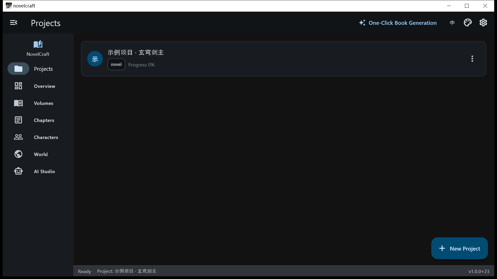

Books are organized as projects. Each card shows the title, type tag and completion progress; **New Project** creates a book, the **⋯** menu holds extra actions, and clicking a card opens that book's workspace.

### Overview

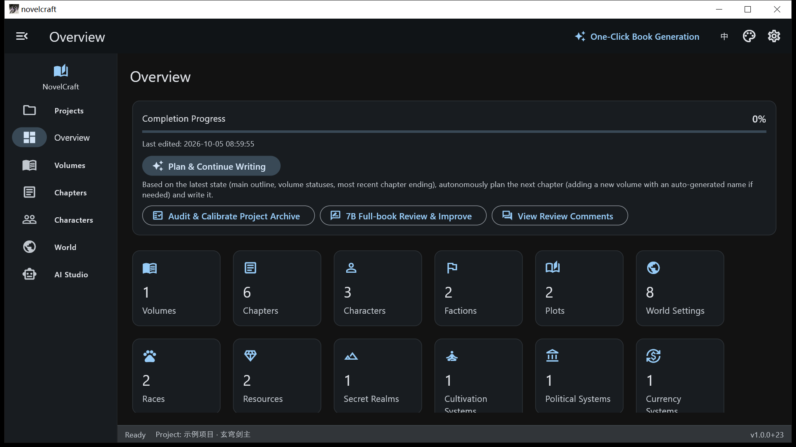

The home page of the selected project. It shows completion progress and the last edit time, offers entries such as **Plan & Continue Writing** and **Review and Calibrate the Project Archive**, and summarises volumes, chapters, characters, factions, plots and every setting category in statistic cards.

### Volumes

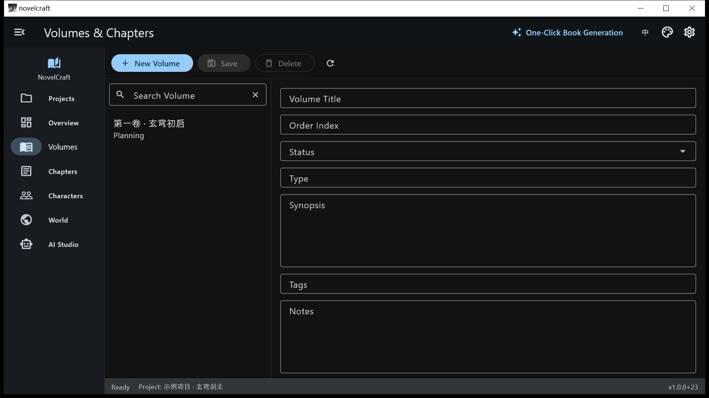

Maintain the story structure by volume. The left column lists volumes; the right panel edits title, order index, status, type, synopsis, tags and notes, with New / Save / Delete / Refresh actions.

### Chapters

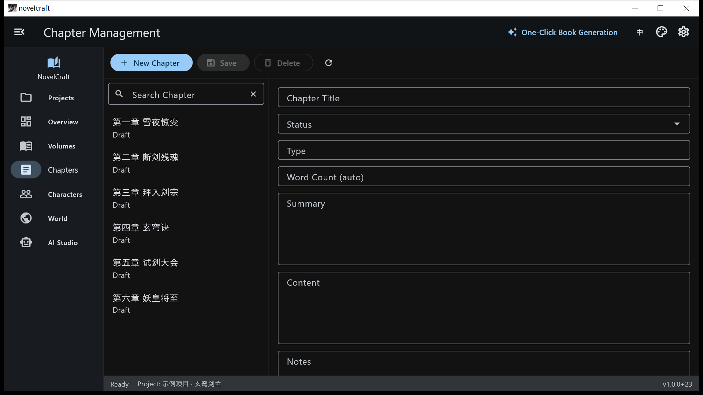

The main editing surface for prose. Chapters are listed by volume and chapter order on the left; the right panel edits title, status, type, word count, summary, content and notes.

### Characters

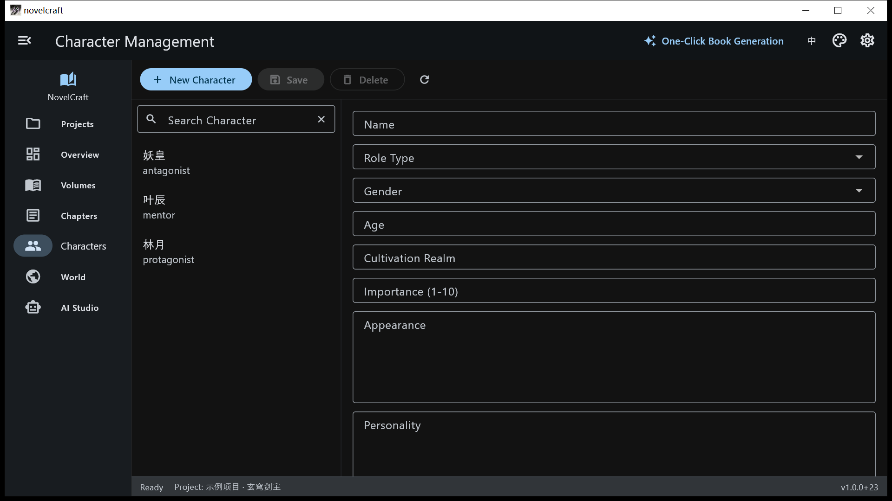

Structured character profiles: name, role type (protagonist / mentor / antagonist and so on), gender, age, cultivation level, importance, appearance and personality.

### World Settings

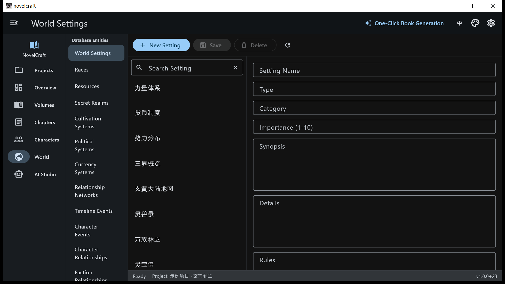

The second-level navigation groups settings into **database entities** (world settings, races, resources, secret realms, cultivation systems, political systems, currency systems, relationship networks, timeline events and more) and **JSON-backed systems** (techniques, equipment, pets, treasures, businesses, professions, judicial, population, maps, dimensions). The right panel edits the selected entry.

### AI Collaboration

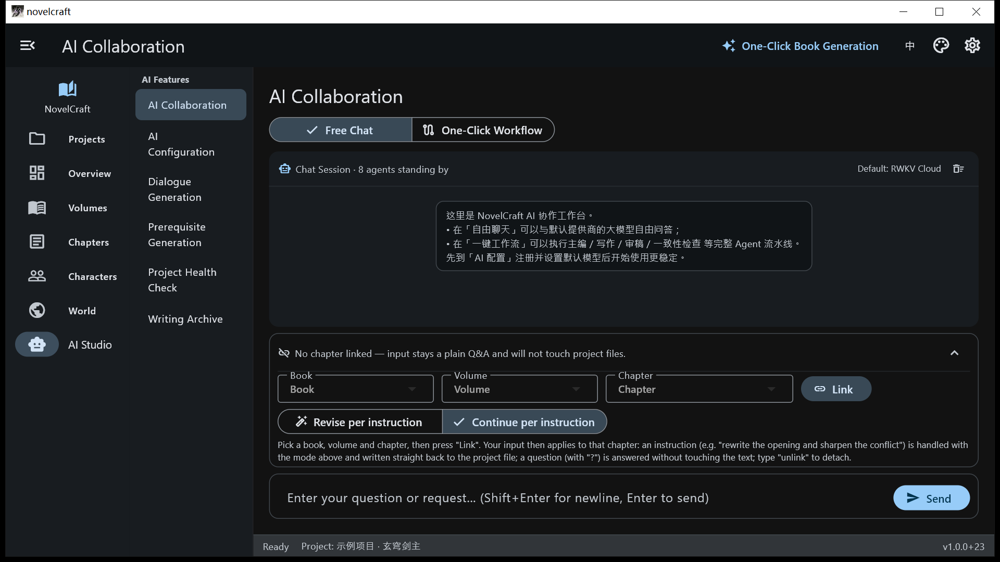

**Free Chat** asks the default model open questions; **One-Click Workflow** runs a preset pipeline. The panel below links the conversation to a specific book, volume and chapter so your input applies to that chapter's prose. Questions ending with a question mark are answered only — they never modify the text.

### AI Configuration

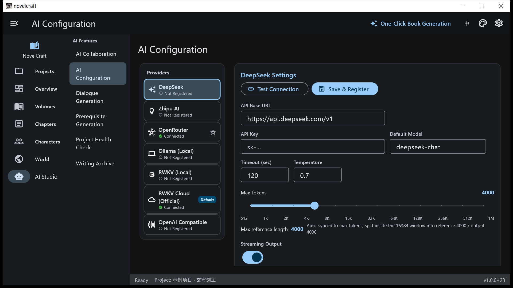

Configure each provider: API base URL, API key, default model, timeout, temperature, max tokens (always equal to the max reference length) and streaming output, with **Test Connection** and **Save & Register**. The left column lists providers with their connection status and the default marker.

### Reviewers and Guest Readers

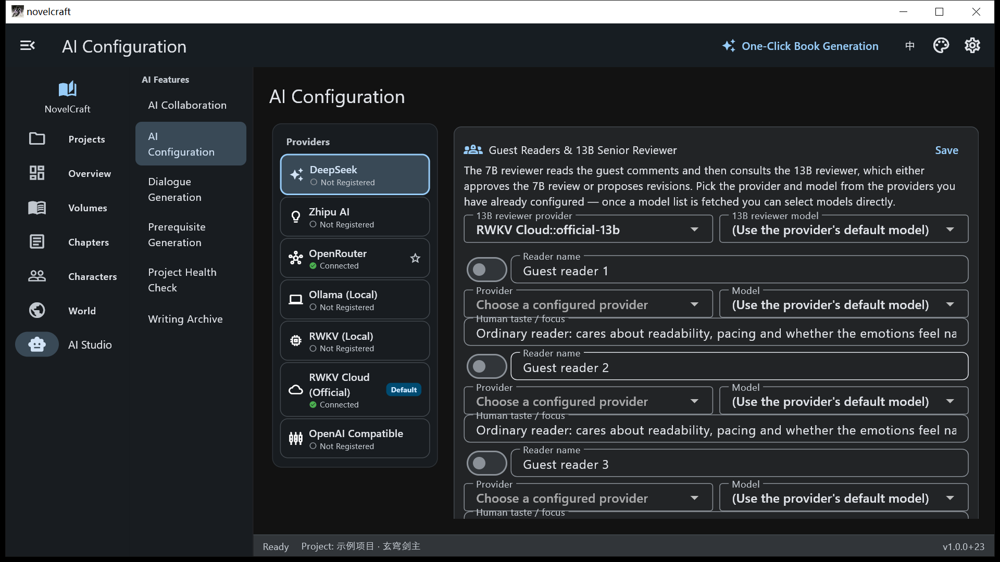

The review-team card sits at the bottom of the AI Configuration page: the 7B reviewer reads guest comments first, then consults the 13B senior reviewer, who may accept the 7B result or propose revisions. **Both platform and model are dropdown selections** — platforms list the providers that are already configured, and the model list is pulled from that platform's prepared models (persisted default model plus the runtime model list), so nothing has to be typed by hand. The card's labels are fully localised and follow the selected interface language.

### Settings

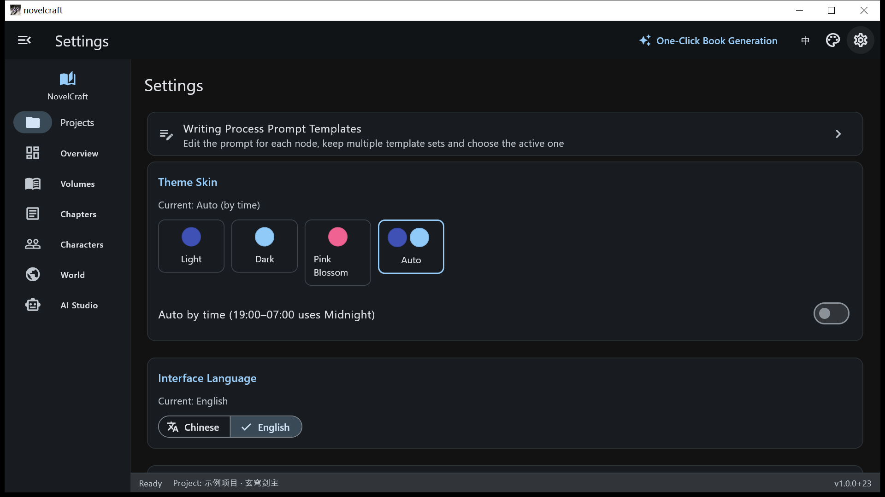

A **Settings** entry was added to the right side of the top navigation bar, so the settings page is reachable directly from the main window. It manages the writing-stage prompt templates, theme skins (Light / Dark / Pink Blossom / Auto by time), interface language (Chinese / English) and diagnostics (Agent batching, AI health check).

### Writing Prompt Templates

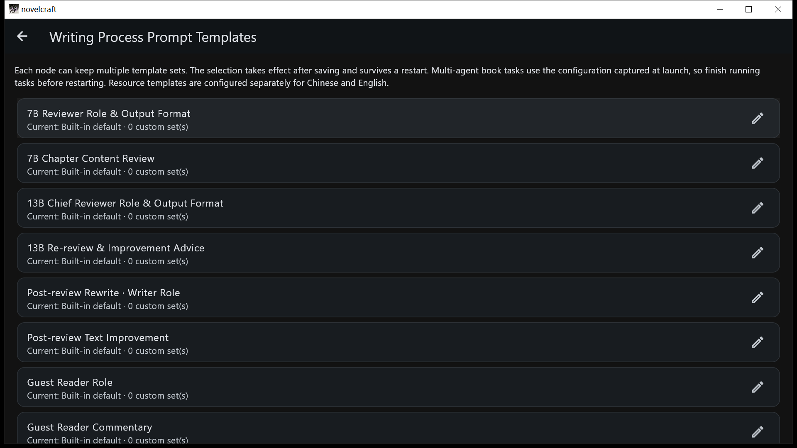

Every writing stage can keep several prompt variants: pick one, save, and it takes effect — and it survives a restart. Built-in templates are read-only until you copy one to a new variant. Stages that dispatch or validate work must keep their original JSON field structure, and prose stages must still output prose only.

## From an Idea to a Novel

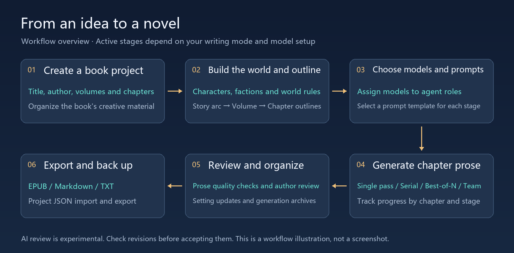

Start with a small test project to become familiar with the workflow:

1. **Create a project:** Enter a title and author, then plan volumes and chapters.
2. **Prepare the setting:** Define the protagonist, important characters, world rules and central conflict.
3. **Configure models:** Enter the service address, credentials and model, then test the connection.
4. **Choose a mode and templates:** Select how prose should be generated and customize relevant prompt stages.
5. **Generate and review:** Watch chapter progress, then check prose, outline continuity and setting changes.
6. **Organize and export:** Create an ebook, a combined manuscript or a collection of project materials.

You can also use project management, worldbuilding and manual editing on their own, introducing AI only where it helps your process.

## Four Prose Generation Modes

The multi-agent writing wizard offers four approaches to generating chapter prose. They differ in task decomposition, context handling and the number of model calls.

| Mode | How it works | Useful for | Trade-offs |
| --- | --- | --- | --- |
| **Single-pass writing** | One lead writer generates an entire chapter in one call | Short chapters and quick concept checks | Longer chapters may exceed a single response's practical length |
| **Serial segmented writing** | The same lead writer continues segment by segment, carrying forward the preceding ending | A consistent voice and gradual plot progression | Segment boundaries and transitions need review |
| **Best-of-N continuation** | Generates multiple candidates at a stage and selects using length, diversity, unwanted content and repetition checks | Improving usable output through candidate comparison | More calls than a single generation path |
| **Team lead + 9 writers** | Assignment → segment drafting → acceptance → rework or repair → assembly and polishing | Exploring specialized writers and team-based composition | Higher cost and greater need to check consistency between segments |

Specialized writers emphasize areas such as action, dialogue, psychology, suspense and scenery. The selected mode determines which stages run; editing a template does not cause an unrelated mode to invoke that stage.

In the RWKV G1K book-writing preset, a 7.2B role handles planning and polishing, while a 2.9B role handles prose drafting. Actual available models depend on endpoint model IDs and configuration. Preset names do not imply identical capabilities across deployments.

## Prompt Template Configuration

**Turn your preferred writing instructions into reusable templates for individual stages.**

This release exposes **40 configuration entries**: 31 writing, review and setting-update stages, plus 9 language-specific resource templates for cultivation-system generation and dual-agent collaboration.

### Available operations

- Read each stage's built-in prompt.
- Duplicate a built-in template to create a custom version.
- Save multiple templates for one stage, such as “Slow-burn suspense,” “Lively dialogue” or “Restrained narration.”
- Edit both the template name and the full prompt body.
- Select a template and save the selection; it persists across app restarts.
- Delete custom templates or return to the built-in default.
- Inspect dynamic variable descriptions. Saving checks for empty content, duplicate names, unknown variables and missing variables.

### How to configure a stage

Open **Settings → Writing Workflow Prompt Templates**, or use the link in the multi-agent writing wizard. In the current UI, the entry may appear as **写作工艺 Prompt 模板**.

```text
Choose a stage
  → Duplicate as a new template
  → Edit its name and prompt
  → Select the template to activate
  → Save the templates and selection
  → Start a new writing task
```

For example, when editing the best-of-N candidate stage, you could append the following while retaining its original variables and output requirements:

```text
Use third-person limited narration, restricted to what the viewpoint character can perceive.
Advance the scene through actions, dialogue and changes in the environment.
Prefer observable behavior over direct explanations of emotion.
End the passage with an unresolved action or question. Do not add writing analysis.
```

This is an example of additional style instructions, not a complete replacement for the stage's template.

### Variables and scope

| Setting | Behavior |
| --- | --- |
| New workflow variables | Use `{{variableName}}`; runtime values include outlines, prose, titles and target lengths |
| Legacy resource variables | Retain `{variableName}`; follow the reference shown for that stage |
| Configuration scope | Device-wide; the same stage is not configured separately for each book |
| Activation | Saved choices apply to subsequent work; finish and restart long-running tasks before changing templates |
| Built-in templates | Read-only, available for duplication and restoration |
| Output contracts | Assignment, acceptance and review stages still require their expected JSON structure |

Use the exact variable names provided by the stage; do not translate or rename them. Variable validation does not assess literary quality or restore a JSON output contract removed from the prompt. The detailed [User Guide](docs/功能使用说明-v1.0.0+35.md) is currently in Chinese.

## Model Integrations and Agent Roles

### Existing integrations

| Integration | Purpose and requirements |
| --- | --- |
| **Local RWKV** | Connect to a supported local inference service; models, runtime and hardware must be supplied separately |
| **RWKV Cloud** | Configure endpoint, model and Cloudflare Access authentication; save separate endpoint profiles |
| **OpenAI-compatible APIs** | Connect to services implementing the compatible chat protocol; parameter support depends on the server |
| **DeepSeek** | Connect through the provider's configuration |
| **ZhipuAI** | Connect through the provider's configuration |
| **OpenRouter** | Select available models through its provider configuration |
| **Ollama** | Connect to models deployed in an Ollama service |

The app saves configuration locally and attempts to restore it at startup. Cloud calls require network access and valid credentials. Pricing, quotas and availability are determined by the service provider.

RWKV Cloud presets cover 1.5B, 3B, 7B and 13B endpoints. Fetch model lists from the relevant endpoint rather than assuming model IDs are interchangeable.

### Agent responsibilities

| Role | Main responsibilities |
| --- | --- |
| Editor / MainAgent | Story planning, draft organization and polishing |
| Assistant / SubAgent | Requirement clarification, drafting and refinement |
| Team lead | Segment planning, assignment, acceptance and assembly |
| Specialized writers | Draft assigned passages with different creative emphases |
| Setting archivist | Extract setting changes supported by evidence in completed prose |
| Reviewers and guest readers | Identify issues and suggest improvements in the experimental review workflow |

An agent's role and a model's parameter count are different concepts. Actual provider, endpoint and model selection depends on the relevant configuration and the service's routing implementation.

## Reviewers and Guest Readers

The app includes configuration and comment entry points for guest readers, a 7B reviewer and a 13B senior reviewer, exploring multiple perspectives on a manuscript.

The workflow is organized as follows:

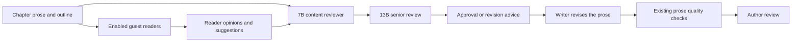

- **Guest readers:** Up to three profiles, with configurable names, models and tastes—for example, mystery logic, character emotions or web-novel pacing.
- **7B reviewer:** Reads chapter material, outlines and reader comments to identify factual, setting, timeline, repetition and narrative issues.
- **13B senior reviewer:** Approves existing advice or proposes further revisions.
- **Writer:** Revises based on comments, with results passing through existing prose quality checks.

**This workflow is still being developed and should not be treated as a reliable unattended whole-book revision system.** Known limitations include context coverage for long chapters, rewrite length protection, enforcement of review decisions and comment history. Export a copy of important manuscripts before automatic revision and inspect the result. See the [Release Handoff](docs/项目交接-v1.0.0+35.md) (Chinese) for technical details.

## Quick Start

### Use a release package

Visit [GitHub Releases](https://github.com/LuckySongXiao/Novelcraft_Flutter/releases) to see which files have actually been uploaded. The source version shown here does not imply that matching binaries have been published. If no package is available, build from source using the instructions below.

| Platform | Package | Usage |
| --- | --- | --- |
| Windows | `novelcraft_<version>_windows_release.zip` | Extract everything and run `novelcraft.exe`; keep the adjacent DLLs and `data` directory |
| Android | `novelcraft_<version>_release.apk` | Install the APK; an in-place upgrade requires compatible package identity and signing |

“Portable” on Windows means no installer is required. User data is still written to system application-data or documents directories rather than being stored entirely beside the EXE. The current Android build requires Android 7.0 / API 24 or later.

### Your first writing session

1. Create or choose a book project and explore volumes, chapters, characters and worldbuilding.
2. Open AI Configuration, enter the service address, credentials and model, then save and test the connection.
3. Configure editor and writer roles as needed.
4. Validate connectivity, writing mode and prompts with one volume and one chapter before scaling up.
5. Review the generated material, then export it or continue editing.

## Import, Export and Data Storage

### Output and migration formats

| Format | Main use |
| --- | --- |
| **EPUB** | Package the current project's chapters into an ebook in volume and chapter order |
| **Combined Markdown / TXT** | Merge chapter prose into a manuscript for reading, submission or further editing |
| **Structured Markdown / TXT folders** | Export material grouped by volumes, chapters, characters, factions, worldbuilding and other sections |
| **Project JSON** | Import and export project data for migration and project backups |

EPUB and manuscript exports are intended for reading and delivery, not complete application backups. Project JSON also does not include every model configuration or personal prompt preference.

### Local data and privacy

- Main application data is persisted through **Drift / SQLite**.
- Extended worldbuilding material, archives and some configuration use local JSON or key-value storage.
- On native platforms, the database is managed through the application's documents directory. Windows key-value material is stored under `%APPDATA%\NovelManagement`. A complete backup should cover both the database and this material.
- Windows prompt configuration is stored at `%APPDATA%\NovelManagement\ai_config\writing_prompt_templates.json`.
- Android data is stored in application-specific locations; uninstalling may remove it.
- Cloud model calls send the relevant prose, settings and context to the selected service. Locally managing material and invoking cloud inference are separate data-processing operations.
- Treat model credentials as sensitive local configuration. Do not commit personal configuration directories, signing files or real API keys.

## Development and Builds

### Requirements

| Component | Current development and build baseline |
| --- | --- |
| Flutter | 3.38.5 stable |
| Dart | 3.10.4, bundled with Flutter |
| Windows toolchain | Visual Studio with the Desktop development with C++ workload |
| Android toolchain | Android SDK and compatible Java / Gradle environment; inspect with `flutter doctor -v` |
| Local AI, optional | The relevant inference service, model files and sufficient hardware resources |

`pubspec.yaml` includes analyzer and dart_style constraints matched to the current Dart SDK. When upgrading the SDK, also verify code generation and dependency compatibility.

### Clone and run

```bash
git clone https://github.com/LuckySongXiao/Novelcraft_Flutter.git
cd Novelcraft_Flutter
flutter doctor -v
flutter pub get
flutter run -d windows
```

For Android, connect a device, inspect `flutter devices`, then run `flutter run -d <device-id>`.

### Build release packages

```bash
flutter build windows --release
flutter build apk --release
```

- Windows output: `build/windows/x64/runner/Release/`. Distribute the entire directory.
- Android output: `build/app/outputs/flutter-apk/app-release.apk`.
- Android signing uses a local `android/key.properties` file and private key. Without this configuration, the current build script may use debug signing. Verify signatures before publishing to avoid upgrade incompatibilities.
- The Android toolchain has encountered an issue where the `integration_test` plugin is incorrectly registered in release builds. The verified temporary workaround and dependency restoration procedure are described in the [Release Handoff](docs/项目交接-v1.0.0+35.md) (Chinese).

If Windows build tools cannot handle a path containing Chinese characters, use an ASCII project path or map an unused drive letter:

```powershell
subst X: "D:\Projects\Novelcraft_Flutter"
Set-Location X:\
flutter build apk --release
```

### Other platforms

The repository retains Web, Linux, macOS and iOS project directories. Flutter provides the cross-platform foundation, but **build verification for this release focuses on Windows and Android**. Other platforms require their own toolchains and functional validation.

For Web, start with `flutter build web --release`. Do not assume that local file operations, model service access, cross-origin behavior or browser storage behave like their desktop equivalents.

## Architecture and Directory Layout

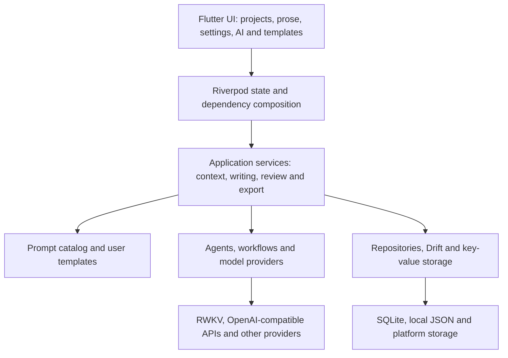

```text
lib/
├── ai/                    Model adapters, agents, workflows, RWKV and output handling
├── application/services/  Writing, review, context, templates, sync and export services
├── core/                  Dependency composition, startup and resource loading
├── data/                  Database, tables, repositories and storage abstractions
├── l10n/                  Localization resources
├── theme/                 Themes and appearance settings
└── ui/                    Pages, layouts, widgets and UI state
assets/prompts/             Bundled prompt resources
test/                      Unit and widget tests
integration_test/          Integration and live model endpoint tests
docs/                      Guides, handoff notes and README illustrations
tool/, tools/, scripts/    Validation and helper tools
android/, windows/         Primary delivery platform projects
```

For prompt-related development, start with:

- [Stage catalog](lib/application/services/writing_prompt_catalog.dart): Default prompts, variables and stage names.
- [Template configuration model](lib/application/services/writing_prompt_templates.dart): Validation, selection, rendering and persistence.
- [Template settings page](lib/ui/pages/writing_prompt_settings_page.dart): Editing and saving interactions.
- [Service composition](lib/core/di.dart): Connecting user configuration to runtime workflows.

## Testing and Verification

Routine checks:

```bash
flutter analyze --no-pub
flutter test
flutter test test/writing_prompt_templates_test.dart
```

Tests requiring real endpoints live in `integration_test/`. For example, with authorized RWKV service access, supply credentials through runtime arguments:

```bash
flutter test integration_test/rwkv_cloud_live_test.dart -d windows --dart-define=RWKV_CF_ID=YOUR_CLIENT_ID --dart-define=RWKV_CF_SECRET=YOUR_CLIENT_SECRET
```

Live endpoint tests make network requests and depend on deployment, quotas and service availability. Do not put actual credentials in this README or test source files.

**Latest recorded verification for 1.0.0+35, dated 2026-10-04:**

| Check | Result |
| --- | --- |
| Static analysis | Passed |
| New prompt tests | 7 passed, covering persistence, variables, actual service input and reopening the editor |
| Full unit / widget suite | 392 passed, 1 skipped, 1 failed |
| Windows release build | Successful |
| Android release build and signature verification | Successful; signature matches the previous version |
| Physical Android device testing and live cloud writing evaluation | Not performed in this verification round |

The single failure is an existing multi-agent end-to-end test whose highly repetitive final-draft fixture triggers the current prose quality checks. The checks were not relaxed to accept that fixture. This is a record of local verification, not a claim that continuous integration is fully green.

## Current Status and Known Limitations

| Area | Current status or limitation |
| --- | --- |
| Prompt configuration | Connected to actual calls; device-wide configuration, without per-book isolation or template import/export UI |
| Guest reader configuration | Entry points and comment flow exist; toggle state, model selection and unavailable-model fallback need improvement |
| 13B review | Review calls and advice exist; the enable switch and enforcement of accepted plans before rewriting need improvement |
| Automatic review and revision of long chapters | Context coverage and rewrite budgets are limited; complete revision backups, length protection and concurrency checks are missing. Avoid unattended replacement of important manuscripts |
| Automatic setting updates | Fact extraction and application exist for some database modules; coverage is not complete across all sections |
| Project archive reconciliation | Currently handles names and orphaned records; full reconciliation of overview and archive word totals remains unfinished |
| General agent module routing | Contract and routing foundations exist; execution connections for all business modules remain incomplete |
| Platform compatibility | Windows and Android are the main delivery targets; other platforms need further verification |

See the [Release Handoff](docs/项目交接-v1.0.0+35.md) (Chinese) for implementation details, build issues and outstanding work.

## Documentation and Contributions

The reference documents below are currently in Chinese. This English README covers the main features, setup process and limitations.

| Document | Contents |
| --- | --- |
| [User Guide · 1.0.0+35](docs/功能使用说明-v1.0.0+35.md) | Installation, upgrades, prompt configuration, variables, scope and limitations |
| [Release Handoff · 1.0.0+35](docs/项目交接-v1.0.0+35.md) | Implementation, integration points, builds, tests and remaining work |
| [Historical Handoff Notes](HANDOFF.md) | Migration history and progress records; use current release documents for present status |
| [Troubleshooting Notes](PITFALLS.md) | Toolchain, model interfaces and historical issue investigation |
| [RWKV G1K Writing Workflow](docs/RWKV-G1K-双模型写作工艺.md) | Two-model role allocation and implementation notes |

Use [Issues](https://github.com/LuckySongXiao/Novelcraft_Flutter/issues) for bug reports and suggestions, and [Pull Requests](https://github.com/LuckySongXiao/Novelcraft_Flutter/pulls) to contribute changes.

When reporting a problem, include the app version, operating system, writing mode, model provider and sanitized reproduction steps. A short fictional passage is sufficient for prose-related examples. For code contributions, explain the behavior change and run the checks relevant to your modification.

README illustrations live in `docs/images/`. To regenerate the English versions, install Pillow and run:

```bash
python docs/images/generate_readme_images.py --language en --font /path/to/font.ttf
```

Use `--language zh` with a Chinese-capable font for the Chinese versions. The script defaults to Microsoft YaHei on Windows when `--font` is omitted. It is a documentation helper, not an application runtime dependency.

GUI screenshots live in `docs/images/shots/` (Simplified Chinese) and `docs/images/shots/en/` (English). They are captured from the running Windows desktop build: run `docs/images/tools/seed_demo_data.py` first to restore the built-in sample project data, switch the interface language inside the app, then drive `docs/images/tools/capture_screenshots.ps1`.

Packaging is scripted too: `python tools/sync_release_snapshot.py` refreshes the clean source snapshot from the working tree (and folds in `docs/images/`), and `python tools/package_release.py` rebuilds the Windows portable folder and zip, the source zip and the APK, printing each file's byte size and SHA256 ready for the release manifest.

## License

This project is licensed under the [MIT License](LICENSE).

Flutter, Dart, RWKV and third-party models and services remain subject to their respective licenses or terms. The repository does not include cloud service credits, private credentials or model weights.
