# NovelCraft · AI 小说创作工作台

**简体中文** | [English](README.en.md)

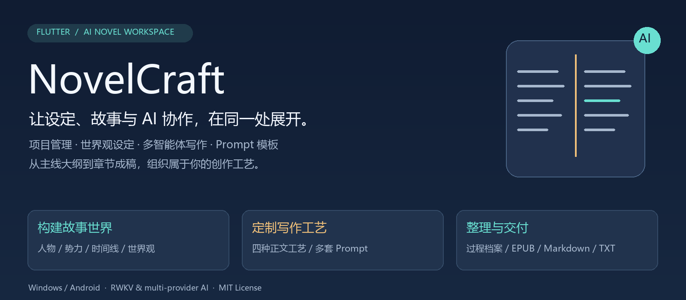

<p align="center">
  
  
  
  
  <a href="LICENSE"></a>
</p>

<p align="center">
  <a href="https://github.com/LuckySongXiao/Novelcraft_Flutter">项目主页</a> ·
  <a href="https://github.com/LuckySongXiao/Novelcraft_Flutter/releases">版本发布</a> ·
  <a href="docs/功能使用说明-v1.0.0+35.md">使用说明</a> ·
  <a href="https://github.com/LuckySongXiao/Novelcraft_Flutter/issues">问题反馈</a>
</p>

**NovelCraft 将书籍项目、人物世界观、大纲、章节正文和 AI 协作整理到同一个工作台中。** 你可以手动管理故事资料，也可以接入 RWKV 或其他模型，让不同 Agent 参与规划、写作、润色与审查，并为每个工艺节点配置自己的 Prompt。

项目由 C# WPF 版本迁移到 Flutter，当前主要交付 Windows 桌面便携版和 Android APK。适合需要管理长篇设定的作者、希望尝试多模型协作的创作者，以及研究 AI 写作流程的开发者。

> 当前代码版本：**1.0.0+35**。本版重点是“写作工艺节点 Prompt 多模板配置”。内容审查与自动改进仍属于实验功能，具体边界见[当前状态与已知限制](#当前状态与已知限制)。文中的插图为功能流程示意，实际界面截图见[界面截图](#界面截图)。

## 目录

- [功能全景](#功能全景)
- [界面截图](#界面截图)
- [一部小说的创作流程](#一部小说的创作流程)
- [四种正文写作工艺](#四种正文写作工艺)
- [Prompt 模板配置](#prompt-模板配置)
- [模型接入与 Agent 分工](#模型接入与-agent-分工)
- [审查员与客座读者](#审查员与客座读者)
- [快速开始](#快速开始)
- [导入导出与数据存储](#导入导出与数据存储)
- [开发与构建](#开发与构建)
- [架构与目录](#架构与目录)
- [测试与验证](#测试与验证)
- [当前状态与已知限制](#当前状态与已知限制)
- [文档与参与贡献](#文档与参与贡献)

## 功能全景

### 1. 以书籍为单位组织创作

每部小说拥有独立的项目上下文，卷宗、章节、人物、情节和设定围绕项目组织。

- **项目管理**：创建和管理书籍项目，维护基本资料，进入对应创作空间。
- **项目概览**：集中查看项目资料、统计及相关操作入口。
- **分卷与章节**：维护卷章结构、章节标题、摘要、正文与状态；章节列表按分卷序号、章节序号组织。
- **大纲管理**：把主线构想逐步拆解到分卷和章节，作为后续生成的参考。
- **过程档案**：保存生成过程中的大纲、章节记录与相关描述，便于回看创作过程。

### 2. 建立可以持续维护的故事世界

人物、势力和世界观有专门的资料区域，方便在长篇创作中查阅与修订。

| 资料类型 | 管理内容 |
| --- | --- |
| 人物 | 角色设定、人物事件、人物关系与履历 |
| 势力 | 组织设定、势力关系及相关状态 |
| 情节 | 主线与支线、关键事件、关联人物及章节 |
| 时间与关系 | 时间线事件、参与者与关系网络资料 |
| 世界观基础 | 世界设定、种族、资源、秘境 |
| 修炼体系 | 修炼系统、境界层级、功法资料 |
| 社会体系 | 政治系统、职位、货币与经济资料 |
| 扩展体系 | 装备、灵宠、灵宝、商业、职业、司法、生民、地图、维度 |

这些资料既可供作者手动维护，也可在已接入的 AI 流程中作为上下文。章节完成后的设定抽取流程会尝试根据正文事实更新对应实体，并要求提供正文证据；覆盖范围与自动化限制见后文。

### 3. 在正文创作中使用 AI 助手

- **大纲生成、章节生成与续写**：依据任务要求及项目上下文组织模型输入。
- **润色与改写**：对正文提出修改要求，长文改写使用分段处理路径。
- **选中文本协作**：围绕选区及相邻上下文进行处理，减少请求作用范围不明确的问题。
- **双 Agent 协作**：由需求整理、主编草稿、精修等阶段共同完成创作任务。
- **对话生成**：通过专门页面组织角色对话创作。
- **输出质量检查**：对问答串入、重复、正文污染及长度等问题执行相应的清洗或质量检查。

质量检查用于降低常见错误，不能保证模型输出始终符合剧情与文学要求。重要章节仍需要作者复核。

### 4. 查看后台生成进度

多智能体写书任务启动后，可以通过“写作中”入口查看章节矩阵与阶段进度。团队工艺会区分规划、写作、验收、返工、组长补写、润色等状态，便于定位任务停留在哪一步。

应用同时提供模型连接测试、AI 健康与并发配置等辅助入口。并发能力取决于平台服务、模型端点和当前运行配置。

### 5. 桌面与移动端体验

- Windows 使用侧栏组织创作分区，适合长时间编辑和资料管理。
- 手机端提供底部主导航及更多页面入口，适配较窄屏幕。
- 提供白昼、黑夜、花漾少女三套内置主题，以及按时间切换的设置。
- 提供中英文界面，可一键切换；功能页标签、状态栏、审查员配置卡与写作工艺 Prompt 模板均已完整双语（含 31 个工艺节点的英文名）。

## 界面截图

以下截图均来自 **1.0.0+35 在 Windows 桌面端实际运行**的界面（界面语言：简体中文；示例内容为内置示例项目）。英文界面的同类截图见 [README.en.md](README.en.md)。

### 项目管理

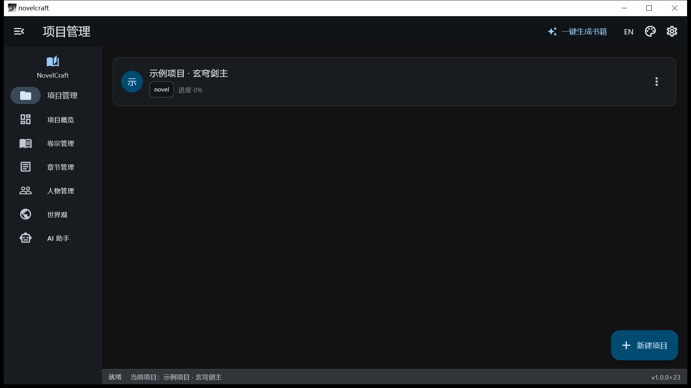

书籍以项目为单位组织。卡片显示书名、类型标签与完成进度；右下角「新建项目」创建新书，卡片右侧「⋯」提供更多操作；点击卡片即进入该书的创作空间。

### 项目概览

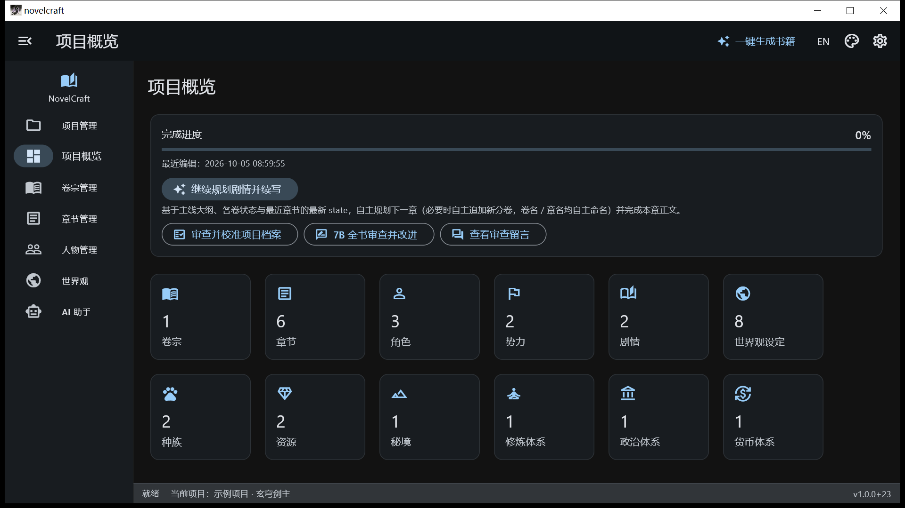

选中项目后的首页。显示完成进度与最近编辑时间，提供「继续规划剧情并续写」「审查并校准项目档案」等入口，并用统计卡片汇总卷宗、章节、角色、势力、剧情及各类设定的数量。

### 卷宗管理

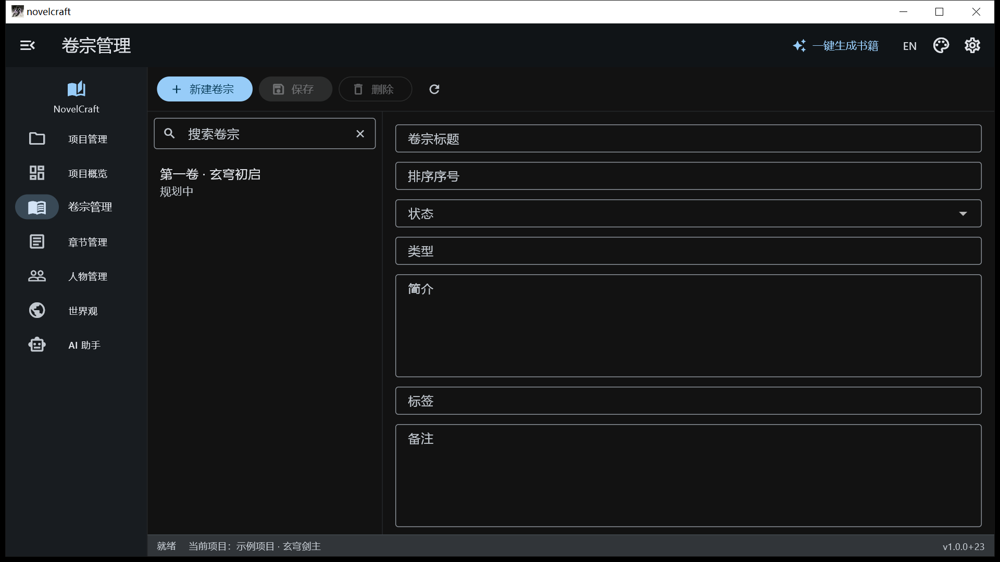

按分卷维护故事结构。左侧列出卷宗，右侧编辑标题、排序序号、状态、类型、简介、标签与备注，并提供新建、保存、删除与刷新。

### 章节管理

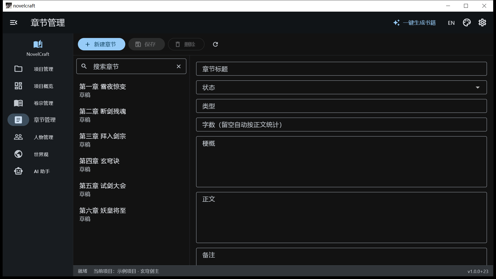

正文的主要编辑区。左侧按分卷与章节序号排列章节，右侧编辑标题、状态、类型、字数、梗概、正文与备注。

### 人物管理

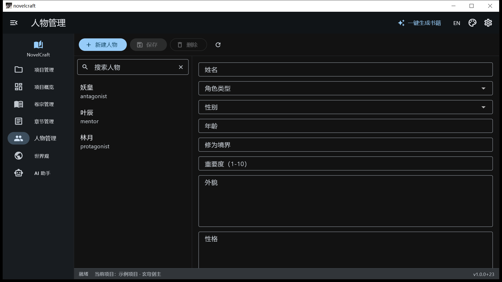

人物的结构化档案，可维护姓名、角色类型（主角 / 导师 / 反派等）、性别、年龄、修为境界、重要度、外貌、性格等字段。

### 世界观

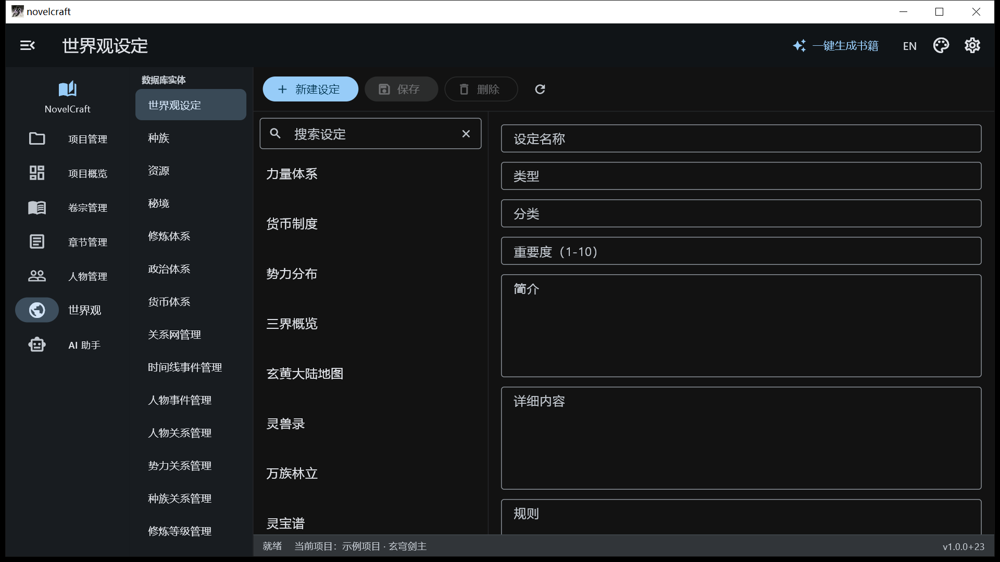

世界观的二级导航按「数据库实体」（世界设定、种族、资源、秘境、修炼体系、政治体系、货币体系、关系网管理、时间线事件管理等）与「JSON 体系」（功法、装备、灵宠、灵宝、商业、职业、司法、生民、地图、维度）分组，右侧编辑对应的设定条目。

### AI 协作创作

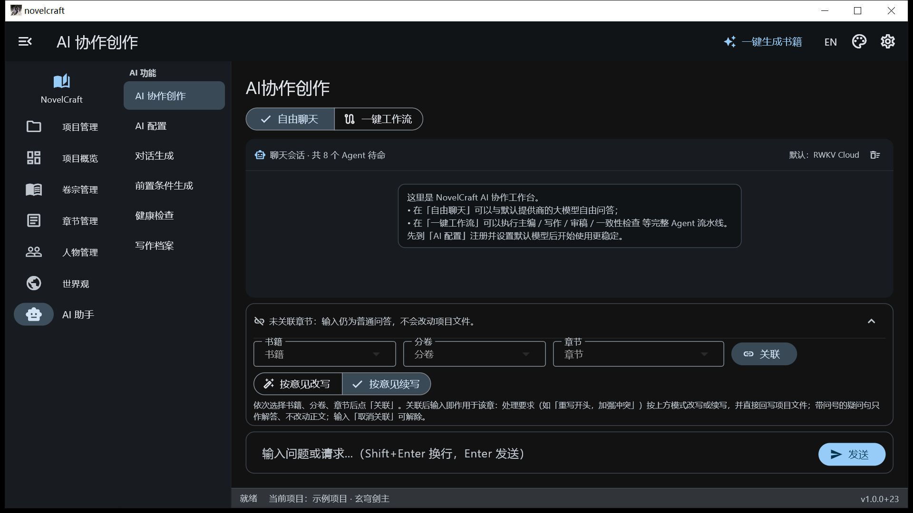

「自由聊天」用于向默认模型自由提问；「一键工作流」按预设流水线执行创作任务。下方可将对话关联到具体书籍、分卷与章节，使输入直接作用于该章正文；带问号的疑问句只作解答，不改动正文。

### AI 配置

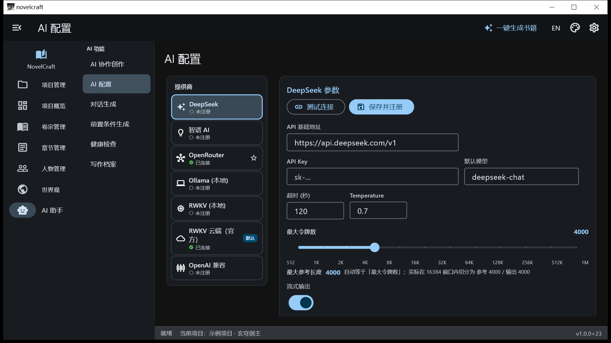

逐个供应商配置接入信息：API 地址、API Key、默认模型、超时、Temperature、最大令牌数（与最大参考长度恒等）与流式输出，并提供「测试连接」「保存并注册」。左侧列出各供应商及其连接状态与默认标记。

### 客座读者与 13B 高级审查员

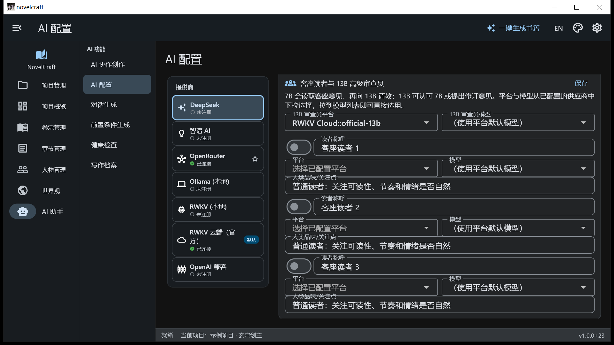

审查团队的配置卡位于 AI 配置页下方。7B 先读取客座意见，再向 13B 请教，13B 可认可 7B 或提出修订意见。**平台与模型均改为下拉选择**：平台列出已配置的供应商，模型直接拉取该平台已配置好的模型（含持久化默认模型与运行时模型列表），无需手工输入。

### 设置

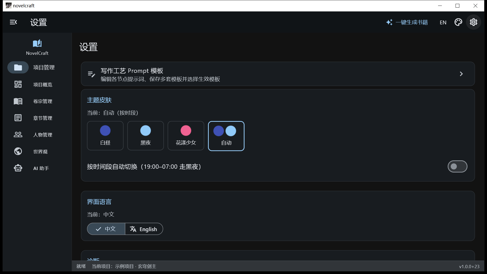

顶部导航条右侧新增「设置」入口，主界面可直接进入设置页。设置页集中管理「写作工艺 Prompt 模板」、主题皮肤（白昼 / 黑夜 / 花漾少女 / 自动按时段）、界面语言（中文 / English）与诊断入口（Agent 攒批配置、AI 健康检查）。

### 写作工艺 Prompt 模板

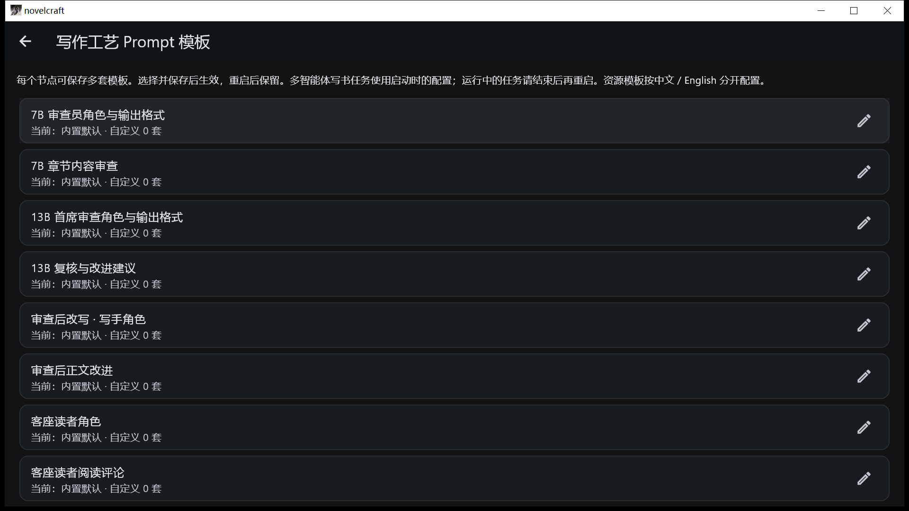

每个工艺节点都可保存多套提示词模板：选择并保存后生效，重启后保留。内置模板只读，点击「复制为新模板」后可修改；派活、验收等节点需保留原有 JSON 字段结构，正文节点保持仅输出正文的要求。

## 一部小说的创作流程

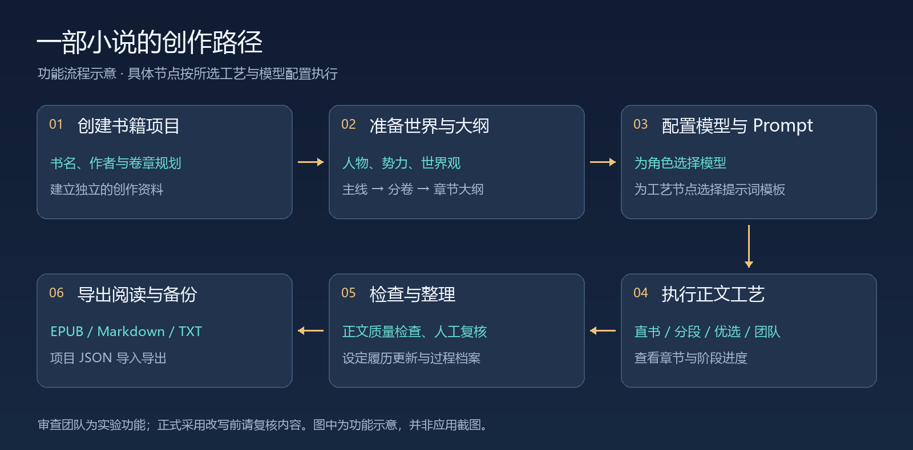

推荐先用一部小规模测试项目熟悉流程：

1. **创建项目**：填写书名和作者，规划卷数与章数。
2. **整理设定**：建立主角、重要人物、世界规则与核心冲突。
3. **配置模型**：填写服务地址、认证信息及模型，先测试连接。
4. **选择工艺与模板**：确定正文产出方式，调整需要定制的 Prompt 节点。
5. **生成并复核**：查看章节进度，检查正文、大纲衔接和设定变化。
6. **整理交付**：导出电子书、合并正文或项目资料。

也可以只使用项目管理、设定管理和手动编辑功能，按需要逐步引入 AI。

## 四种正文写作工艺

多智能体写书向导提供四种正文产出方式。不同工艺的区别主要在于如何拆分任务、保留上下文与组织模型调用。

| 工艺 | 工作方式 | 适合的使用场景 | 需要留意 |
| --- | --- | --- | --- |
| **单笔直书** | 主笔一次生成整章正文 | 短章节、快速验证构思 | 长章容易受单次输出长度限制 |
| **主笔分段串行** | 同一主笔按段续写，携带前文结尾 | 希望文风统一、逐段推进剧情 | 需要复核段落边界与承接 |
| **续写优选** | 同一阶段生成多个候选，按长度、多样性、污染和重复情况择优 | 希望通过候选比较提高正文可用性 | 调用量高于单路生成 |
| **组长 + 9 写手** | 派活 → 分段写作 → 验收 → 返工 / 补写 → 拼接润色 | 探索偏向写手分工与团队式创作 | 成本更高，需重点检查拼接一致性 |

团队写手具有打斗、对白、心理、悬疑、环境等不同侧重。工艺本身决定经过哪些节点；修改某个节点的模板，不会让其他工艺自动调用该节点。

RWKV G1K 写书预设中，规划和润色由 7.2B 角色承担，正文由 2.9B 角色承担。实际可用模型以端点返回的模型 ID 和当前配置为准，预设名称不代表所有部署都具有相同能力。

## Prompt 模板配置

**你可以把自己的写作方法保存成可重复使用的节点模板。**

本版开放 **40 个配置项**：31 个写书、审查和设定更新节点，以及 9 个按语言区分的修炼体系 / 双代理资源模板。

### 支持哪些操作？

- 查看各节点的内置提示词。
- 复制内置模板，创建自定义版本。
- 为同一个节点保存多套模板，例如“悬疑慢节奏”“轻快对白”“克制叙述”。
- 编辑模板名称和完整 Prompt 正文。
- 选择要使用的模板，保存后生效，重启后仍保留。
- 删除自定义模板，或切回内置默认。
- 查看动态变量说明；保存时检查空内容、重复名称、未知变量和缺失变量。

### 如何使用？

进入 **设置 → 写作工艺 Prompt 模板**，或从多智能体写书向导进入：

```text
选择节点
  → 复制为新模板
  → 修改名称与 Prompt
  → 选择需要生效的模板
  → 保存模板与选择
  → 启动新的写作任务
```

例如，修改“续写优选候选”时，可以在保留原变量和输出要求的基础上添加：

```text
叙述采用第三人称有限视角，信息范围限制在当前视角人物的感知之内。
优先通过行动、对白和环境变化推进剧情，减少直接解释人物情绪。
段落结尾保留尚未解决的行动或疑问，不额外输出写作分析。
```

这是可追加到模板中的风格要求示例，不是替换整个节点的完整模板。

### 动态变量与生效范围

| 项目 | 规则 |
| --- | --- |
| 新工艺节点变量 | 使用 `{{变量名}}`，运行时填入大纲、正文、书名或目标字数 |
| 旧资源模板变量 | 保留 `{变量名}` 语法，以节点参考说明为准 |
| 配置范围 | 当前设备全局使用，同一节点不按书籍分别保存 |
| 生效时机 | 保存后用于后续任务；长任务建议结束后重新启动 |
| 内置模板 | 只读，可复制修改，随时可恢复为默认 |
| 格式要求 | 派活、验收、审查等节点仍需保留对应 JSON 字段结构 |

变量校验不会判断提示词是否能生成高质量小说，也不会自动修正用户删除的 JSON 输出协议。完整操作步骤见[功能使用说明](docs/功能使用说明-v1.0.0+35.md)。

## 模型接入与 Agent 分工

### 已有模型适配

| 接入方式 | 用途与说明 |
| --- | --- |
| **RWKV 本地** | 对接相应本地推理服务；模型、运行环境和硬件需另行准备 |
| **RWKV Cloud** | 配置云端地址、模型和 Cloudflare Access 认证；支持保存不同端点配置 |
| **OpenAI 兼容接口** | 对接提供兼容聊天协议的服务，具体参数兼容性以服务端为准 |
| **DeepSeek** | 使用对应平台配置接入模型 |
| **智谱 ZhipuAI** | 使用对应平台配置接入模型 |
| **OpenRouter** | 通过平台配置选择可用模型 |
| **Ollama** | 对接 Ollama 服务中已部署的模型 |

配置由应用在本地保存，并在启动时尝试恢复。云端 AI 调用需要网络与有效服务凭据，费用、额度和可用性由服务平台决定。

RWKV 云端预设覆盖 1.5B、3B、7B、13B 端点。模型列表应从各端点获取，不应把不同端点上的模型 ID 视为可直接互换。

### Agent 扮演什么角色？

| 角色 | 主要职责 |
| --- | --- |
| 主编 / MainAgent | 主线规划、草稿组织、润色等 |
| 助手 / SubAgent | 需求整理、具体写作及精修任务 |
| 团队组长 | 拆分段落、分派任务、验收与拼接 |
| 偏向写手 | 按分配任务完成具有不同侧重的段落 |
| 设定档案管理员 | 从已完成正文中抽取有证据支持的设定变化 |
| 审查员与客座读者 | 对内容提出问题和改进意见，当前为实验流程 |

角色分工与模型参数规模是两个概念。实际调用哪一个平台、端点和模型，以相应配置及具体服务的路由实现为准。

## 审查员与客座读者

应用已提供客座读者、7B 审查员和 13B 首席审查员的配置及评论入口，用于探索多视角内容审读。

当前流程按以下顺序组织：


- **客座读者**：最多三位，可配置称呼、模型与品味，例如偏好悬疑推理、关注人物情感、重视网文节奏。
- **7B 审查员**：阅读章节、大纲及读者留言，提出事实、设定、时间线、重复和叙事方面的问题。
- **13B 首席审查员**：对已有意见给出认可或进一步修订建议。
- **写手**：依据评论执行改进，结果经过现有正文质量检查。

**该流程仍在完善，不能视为可靠的无人值守全书修订系统。** 当前长章上下文覆盖、改写长度保护、意见采纳闸门和评论历史等存在已知限制。重要书稿使用自动改写前，请先导出副本，并检查修改结果。具体问题见[本版交接文档](docs/项目交接-v1.0.0+35.md)。

## 快速开始

### 使用发布包

前往 [GitHub Releases](https://github.com/LuckySongXiao/Novelcraft_Flutter/releases) 查看实际已上传的附件。README 中的代码版本不代表对应安装包已经发布到 GitHub；没有附件时可按下文从源码构建。

| 平台 | 文件形式 | 使用方法 |
| --- | --- | --- |
| Windows | `novelcraft_<版本>_windows_release.zip` | 完整解压后运行 `novelcraft.exe`，保留同目录 DLL 与 `data` |
| Android | `novelcraft_<版本>_release.apk` | 安装 APK；覆盖升级要求应用包名与签名兼容 |

Windows“便携版”指无需安装器，用户数据仍写入系统应用数据或文档目录，并非全部保存在 EXE 旁边。Android 当前构建要求 Android 7.0 / API 24 或更新版本。

### 首次创作

1. 新建或选择书籍项目，熟悉卷章、人物和世界观分区。
2. 打开“AI 配置”，填写平台地址、认证信息及模型，保存并测试连接。
3. 根据需要配置主编、写手等角色。
4. 先用一卷一章验证连接、工艺和 Prompt，再增加生成规模。
5. 在项目中查看生成结果，复核后导出或继续编辑。

## 导入导出与数据存储

### 交付与迁移格式

| 格式 | 主要用途 |
| --- | --- |
| **EPUB** | 将当前项目章节按卷章顺序打包为电子书 |
| **合并 Markdown / TXT** | 将章节正文合并成便于阅读、投稿或后续编辑的文稿 |
| **结构化 Markdown / TXT 文件夹** | 按卷章、人物、势力、世界观等分类导出资料 |
| **项目 JSON** | 项目数据导入导出，便于迁移和备份项目资料 |

EPUB 和正文导出主要用于阅读与交付，不等同于完整应用备份；项目 JSON 也不包含全部模型配置和个人 Prompt 偏好。

### 本地数据与隐私

- 主要业务数据由 **Drift / SQLite** 持久化。
- 世界观扩展资料、档案和部分配置使用本地 JSON / 键值存储。
- 原生平台数据库由应用文档目录管理；Windows 的键值资料位于 `%APPDATA%\NovelManagement`。完整备份时需要同时考虑数据库与该资料目录。
- Prompt 配置在 Windows 上保存为 `%APPDATA%\NovelManagement\ai_config\writing_prompt_templates.json`。
- Android 数据位于应用专属存储位置，卸载应用可能导致数据丢失。
- 使用云端模型时，当前任务涉及的正文、设定及上下文会发送给所选服务。基础资料管理与云端推理是不同的数据处理环节。
- 模型凭据属于本地敏感配置，不要把个人配置目录、签名文件或真实 API Key 提交到仓库。

## 开发与构建

### 环境要求

| 组件 | 当前开发 / 构建基线 |
| --- | --- |
| Flutter | 3.38.5 stable |
| Dart | 3.10.4，随 Flutter 提供 |
| Windows 工具链 | Visual Studio 的“使用 C++ 的桌面开发”工作负载 |
| Android 工具链 | Android SDK、对应 Java / Gradle 环境，使用 `flutter doctor -v` 检查 |
| 本地 AI（可选） | 相应推理服务、模型文件及足够的计算资源 |

`pubspec.yaml` 中包含与当前 Dart SDK 配套的 analyzer / dart_style 版本约束。升级 SDK 时请连同代码生成和依赖兼容性一起验证。

### 获取源码并运行

```bash
git clone https://github.com/LuckySongXiao/Novelcraft_Flutter.git
cd Novelcraft_Flutter
flutter doctor -v
flutter pub get
flutter run -d windows
```

连接 Android 设备后，可以运行 `flutter devices` 查看设备，再执行 `flutter run -d <设备ID>`。

### 构建发布包

```bash
flutter build windows --release
flutter build apk --release
```

- Windows 输出目录：`build/windows/x64/runner/Release/`，分发时必须包含整个目录。
- Android 输出文件：`build/app/outputs/flutter-apk/app-release.apk`。
- Android 签名通过本机 `android/key.properties` 和私钥配置。缺少配置时，当前构建脚本可能使用 debug 签名；正式发布前应核验签名，避免覆盖升级失败。
- 当前 Android 工具链出现过 `integration_test` 插件被错误注册到 release 的问题，已验证的临时构建绕行和恢复步骤说明见[本版交接](docs/项目交接-v1.0.0+35.md)。

若 Windows 下构建工具无法处理中文路径，优先将源码放在英文目录；也可以选择未占用盘符进行映射：

```powershell
subst X: "D:\Projects\Novelcraft_Flutter"
Set-Location X:\
flutter build apk --release
```

### 其他平台

仓库保留 Web、Linux、macOS 和 iOS 工程目录。Flutter 提供跨平台基础，但**本版实际构建校验集中在 Windows 与 Android**，其他平台仍需各自工具链和功能适配验证。

Web 可从 `flutter build web --release` 开始验证；本地文件操作、模型服务访问、浏览器跨域和存储行为不能直接按桌面端假定。

## 架构与目录

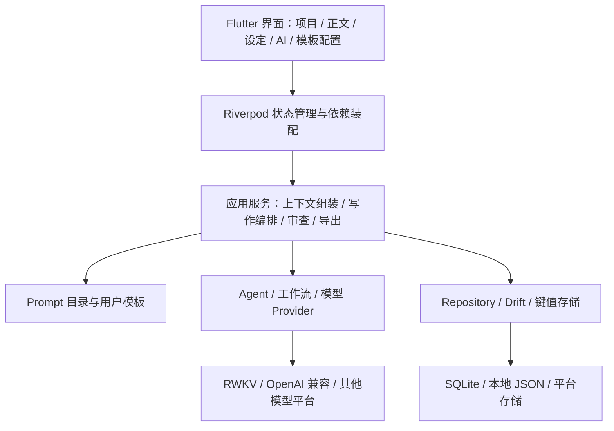

```text
lib/
├── ai/                    模型适配、Agent、工作流、RWKV 与输出处理
├── application/services/  写作、审查、上下文、模板、同步和导出服务
├── core/                  依赖装配、启动与资源加载
├── data/                  数据库、表、Repository 与存储抽象
├── l10n/                  本地化资源
├── theme/                 主题与外观设置
└── ui/                    页面、布局、组件与界面状态
assets/prompts/             随应用提供的资源提示词
test/                      单元与组件测试
integration_test/          集成及真实模型端点测试
docs/                      使用说明、交接记录与 README 配图
tool/、tools/、scripts/     验证及辅助工具
android/、windows/          主要发布平台工程
```

开发 Prompt 功能时，可以从以下文件入手：

- [节点目录](lib/application/services/writing_prompt_catalog.dart)：默认提示词、变量与节点名称。
- [模板配置模型](lib/application/services/writing_prompt_templates.dart)：校验、选择、渲染与持久化。
- [模板设置页面](lib/ui/pages/writing_prompt_settings_page.dart)：编辑和保存交互。
- [服务装配](lib/core/di.dart)：将用户配置接入实际运行流程。

## 测试与验证

常规检查：

```bash
flutter analyze --no-pub
flutter test
flutter test test/writing_prompt_templates_test.dart
```

需要实际端点的测试位于 `integration_test/`。例如，在具备 RWKV 服务授权的环境中，通过运行参数注入凭据：

```bash
flutter test integration_test/rwkv_cloud_live_test.dart -d windows --dart-define=RWKV_CF_ID=YOUR_CLIENT_ID --dart-define=RWKV_CF_SECRET=YOUR_CLIENT_SECRET
```

真实端点测试会发起网络请求，结果受模型部署、额度和服务状态影响。不要把实际密钥填写进 README 或测试源码。

**1.0.0+35 最近一次验证记录（2026-10-04）：**

| 检查 | 结果 |
| --- | --- |
| 静态分析 | 通过 |
| 新增 Prompt 测试 | 7 项通过，包含持久化、变量、实际服务调用与页面编辑重开 |
| 全量单元 / 组件测试 | 392 通过、1 跳过、1 失败 |
| Windows release 构建 | 成功 |
| Android release 构建与签名校验 | 成功，与上一版签名一致 |
| Android 真机与真实云模型效果验收 | 本轮未执行 |

唯一失败项是既有多智能体全链路测试使用高度重复的终稿样例，触发现有正文质量闸门。本次未通过放宽质量限制来接受该样例。这里是一次本地验证记录，并非持续集成“全绿”的声明。

## 当前状态与已知限制

为了方便实际使用和后续协作，以下问题保留明确说明：

| 范围 | 当前状态 / 限制 |
| --- | --- |
| Prompt 配置 | 已接入实际调用；当前为设备全局配置，尚无按书籍隔离或模板导入导出 UI |
| 客座读者配置 | 已有入口与评论流程；开关状态、模型选择体验及不可用模型回退仍需完善 |
| 13B 复核 | 已有复核调用与意见输出；启用开关、方案采纳与自动改写之间的闸门仍需完善 |
| 长章自动审查改写 | 当前审查上下文覆盖和改写预算有限，缺少完整修订备份、长度保护及并发校验；重要书稿不宜直接无人值守覆盖 |
| 自动设定更新 | 已实现部分数据库模块的事实抽取与应用，尚不能宣称所有分区都已完成自动闭环 |
| 项目档案校准 | 当前处理名称及孤儿记录；项目概览和档案总字数的全面校准尚未完成 |
| 通用 Agent 模块路由 | 契约与路由基础已建立，所有业务模块的执行器连接仍待补齐 |
| 平台兼容性 | Windows / Android 为当前主要交付目标，其他平台需进一步验收 |

更多技术细节、已知构建问题和下一步工作见[项目交接文档](docs/项目交接-v1.0.0+35.md)。

## 文档与参与贡献

| 文档 | 内容 |
| --- | --- |
| [功能使用说明 · 1.0.0+35](docs/功能使用说明-v1.0.0+35.md) | 安装升级、Prompt 配置、变量、生效范围与使用边界 |
| [项目交接 · 1.0.0+35](docs/项目交接-v1.0.0+35.md) | 本版实现、接入点、构建过程、测试与未完成项 |
| [历史交接记录](HANDOFF.md) | 项目迁移过程与阶段性记录，最新状态以当前版本文档为准 |
| [踩坑记录](PITFALLS.md) | 工具链、模型接口与历史故障排查 |
| [RWKV G1K 写作工艺](docs/RWKV-G1K-双模型写作工艺.md) | 双模型分工与对应实现说明 |

欢迎通过 [Issues](https://github.com/LuckySongXiao/Novelcraft_Flutter/issues) 提交问题或建议，通过 [Pull Requests](https://github.com/LuckySongXiao/Novelcraft_Flutter/pulls) 参与开发。

报告问题时，建议附上应用版本、操作系统、使用工艺、模型平台与脱敏后的复现步骤；涉及正文时可使用简短的虚构样例。提交代码时请说明行为变化，并运行与改动相关的检查。

README 配图位于 `docs/images/`。如需重新生成，可安装 Pillow 并运行 `generate_readme_images.py`，通过 `--font` 指定支持中文的字体；这只是文档配图工具，不是应用运行依赖。

界面截图位于 `docs/images/shots/`（简体中文）与 `docs/images/shots/en/`（English），均由 Windows 桌面端实机抓取：先运行 `docs/images/tools/seed_demo_data.py` 恢复内置示例项目数据，再在应用内切换界面语言后执行 `docs/images/tools/capture_screenshots.ps1`。

发布件打包同样已脚本化：`python tools/sync_release_snapshot.py` 把当前工程树刷新到干净源码快照（并补入 `docs/images/`），`python tools/package_release.py` 重建 Windows 便携版目录与 zip、源码 zip 与 APK，并直接打印各自的字节数和 SHA256，便于填入发布清单。

## 开源许可

本项目采用 [MIT License](LICENSE)。

Flutter、Dart、RWKV 及所接入的第三方模型与服务分别遵循各自的许可或使用条款。仓库不附带云端服务额度、私人凭据或模型权重。
